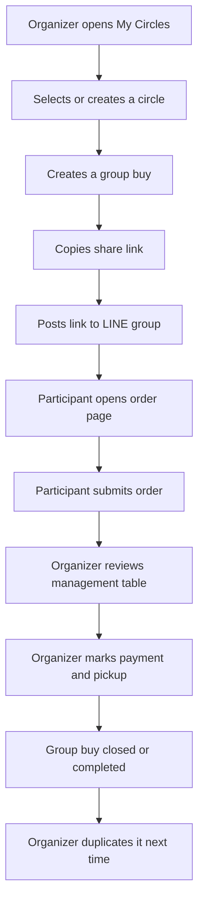
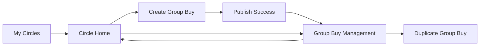
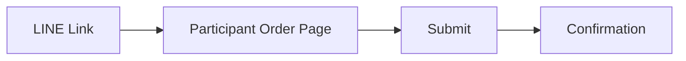

# MVP Wireframes

This document turns the MVP PRD into a low-fidelity product flow. It is intentionally structural: screen purpose, content hierarchy, fields, actions, states, and decision points. Visual styling should be decided later.

## Design Principles

- Mobile first.
- LINE-link friendly.
- Organizer-first management experience.
- Participant submission without app install.
- Task-first, not social-first.
- Show totals and next actions clearly.
- Avoid chat, feed, public marketplace, and seller-backend complexity.

## Primary Flow

The same flow can later support a circle-only member sale by replacing "group buy" with a member listing, while keeping the same submit, count, payment, and pickup management screens.

## Screen Map

| Screen | User | Route Suggestion | Primary Job |
|---|---|---|---|
| My Circles | Organizer | `/circles` | See circles and active work |
| Circle Home | Organizer | `/circles/:circleId` | See active and past group buys |
| Create Group Buy | Organizer | `/circles/:circleId/group-buys/new` | Configure a group buy |
| Participant Order Page | Participant | `/join/:shareToken` | Submit an order from shared link |
| Group Buy Management | Organizer | `/group-buys/:groupBuyId/manage` | Track orders, payment, pickup, export |

## 1. My Circles

### Purpose

Give the organizer a quick overview of all circles and unfinished work.

### Entry Points

- Organizer signs in.
- Organizer returns after creating a group buy.
- Organizer opens app from home screen or browser bookmark.

### Content Hierarchy

1. Header
   - Product name or current workspace label.
   - Account menu.
2. Primary action
   - Create circle.
3. Active attention summary
   - Open group buys.
   - Pending payment count.
   - Group buys ending soon.
4. Circle list
   - Circle name.
   - Description or member count.
   - Active group-buy count.
   - Pending payment count.
   - Last activity.
5. Empty state
   - Explain that the organizer can create a circle and share group-buy links to LINE.
   - Primary action: Create first circle.

### Main Actions

- Create circle.
- Open circle.
- Open active group buy from summary.

### States

- Empty organizer account.
- Normal list with several circles.
- Active work present.
- Loading.
- Error loading circles.

### Low-Fidelity Layout

Top:

- App title.
- Account menu.

Main:

- "Create circle" primary button.
- Compact summary row: active, pending payments, ending soon.
- Circle cards or list rows.

Bottom:

- Optional mobile bottom navigation later, but not required for MVP.

### Product Notes

Do not show public discovery or recommended circles. The user should only see circles they own or manage.

## 2. Circle Home

### Purpose

Let the organizer manage one circle and start a new group buy quickly.

### Entry Points

- From My Circles.
- From a completed group-buy record.
- From a duplicated group buy.

### Content Hierarchy

1. Circle header
   - Circle name.
   - Member count or known participants count.
   - Circle description.
2. Primary action
   - Create group buy.
3. Active group buys
   - Title.
   - Deadline.
   - Response count.
   - Total amount.
   - Pending payment count.
   - Quick status badge.
4. Completed group buys
   - Title.
   - Completion date.
   - Total quantity.
   - Total amount.
   - Duplicate action.
5. Circle settings entry
   - Edit circle name.
   - Share or invite later.

### Main Actions

- Create group buy.
- Open management page.
- Duplicate completed group buy.
- Edit circle details.

### States

- No group buys yet.
- Active group buys.
- Completed group buys only.
- Archived or cancelled group buys.

### Low-Fidelity Layout

Top:

- Back to My Circles.
- Circle name.
- Circle meta.

Main:

- Create group buy button.
- Active group-buy section.
- Completed group-buy section.

Footer:

- Lightweight circle settings link.

### Product Notes

Circle Home should feel like an operations dashboard, not a community page. Avoid post composer, feed, reactions, and chat affordances.

## 3. Create Group Buy

### Purpose

Let the organizer configure enough information for participants to submit orders and for the organizer to manage results.

### Entry Points

- From Circle Home.
- From "Duplicate" on a completed group buy.

### Content Hierarchy

1. Group buy basics
   - Title.
   - Description.
   - Deadline.
2. Items
   - Item name.
   - Variant or option.
   - Unit price.
   - Optional max quantity.
   - Add another item.
3. Participant fields
   - Name required.
   - Contact hint optional.
   - Note optional.
4. Payment instructions
   - Bank transfer details.
   - Mobile payment account.
   - Cash on pickup.
   - Custom note.
5. Pickup instructions
   - Pickup location.
   - Pickup time or rule.
   - Delivery note optional.
6. Preview and publish
   - Save draft.
   - Publish and copy link.

### Required Fields

- Title.
- At least one item.
- Unit price for each item.
- Deadline.

### Optional Fields

- Description.
- Variant.
- Max quantity.
- Payment instructions.
- Pickup instructions.

### Main Actions

- Add item.
- Remove item.
- Save draft.
- Publish group buy.
- Publish and copy link.

### Validation

- Title cannot be blank.
- Item name cannot be blank.
- Unit price must be a non-negative number.
- Deadline must be in the future for publishing.
- At least one item must be orderable.

### States

- New group buy.
- Duplicated group buy with prefilled fields.
- Draft saved.
- Publishing.
- Publish success with share link.
- Validation error.

### Low-Fidelity Layout

Top:

- Back to Circle Home.
- Page title: Create group buy.

Main:

- Basics section.
- Items section with repeatable rows.
- Payment section.
- Pickup section.

Sticky bottom action:

- Save draft.
- Publish.

### Product Notes

The form must stay short enough for mobile use. A circle-only member sale may add seller name and optional available quantity, but advanced seller fields such as SKU, tax, logistics, coupons, discount tiers, storefront settings, and public marketplace controls should remain out of scope.

## 4. Participant Order Page

### Purpose

Let a participant submit an order from a shared LINE link without creating an account.

### Entry Points

- LINE group link.
- Direct share link.
- Browser history after opening link.

### Content Hierarchy

1. Group buy summary
   - Title.
   - Circle name.
   - Deadline.
   - Organizer note.
2. Item selection
   - Item name.
   - Variant.
   - Unit price.
   - Quantity control.
3. Participant details
   - Name.
   - Contact hint optional.
   - Note optional.
4. Order summary
   - Selected items.
   - Quantity.
   - Estimated total.
5. Submit
   - Submit order.
6. Payment and pickup instructions
   - Shown before or after submit, depending on clarity.

### Required Fields

- Participant name.
- Quantity for at least one item.

### Optional Fields

- Contact hint.
- Note.

### Main Actions

- Increase quantity.
- Decrease quantity.
- Submit order.
- Copy order summary after submit.

### Validation

- Participant name cannot be blank.
- Quantity must be greater than zero for at least one item.
- Closed or expired group buys cannot accept new submissions.

### States

- Open and accepting responses.
- Submitted successfully.
- Deadline passed.
- Group buy closed by organizer.
- Invalid or expired share link.
- Submission error.

### Low-Fidelity Layout

Top:

- Group buy title.
- Deadline badge.
- Circle name.

Main:

- Item selector.
- Participant details form.
- Live order summary.
- Submit button.

After submit:

- Confirmation message.
- Order summary.
- Payment instructions.
- Pickup instructions.
- Copy summary action.

### Product Notes

This page is the most important friction point. It should not ask participants to sign up in the MVP. If identity is needed later, use magic links or phone verification only after validating demand.

## 5. Group Buy Management

### Purpose

Give the organizer one clear operating table for all orders, totals, payment status, pickup status, and export.

### Entry Points

- From Circle Home active group buy.
- From publish success.
- From My Circles attention summary.

### Content Hierarchy

1. Header
   - Group buy title.
   - Status badge.
   - Deadline.
   - Share link action.
2. Summary metrics
   - Total orders.
   - Total quantity.
   - Total amount.
   - Unpaid count.
   - Pending pickup count.
3. Action bar
   - Copy share link.
   - Export CSV.
   - Close group buy.
   - Duplicate.
4. Order table or mobile order list
   - Participant name.
   - Item and variant.
   - Quantity.
   - Amount.
   - Note.
   - Payment status.
   - Pickup status.
   - Submitted time.
5. Status controls
   - Mark unpaid.
   - Mark paid.
   - Mark confirmed.
   - Mark picked up.
   - Cancel order.

### Main Actions

- Copy share link.
- Change payment status.
- Change pickup status.
- Export CSV.
- Close group buy.
- Reopen group buy if closed accidentally.
- Duplicate group buy.

### Status Rules

- `unpaid`: participant has submitted but payment is not received.
- `paid`: participant claims payment or organizer marks received.
- `confirmed`: organizer confirms payment.
- `cancelled`: order should be excluded from active totals.
- `pending`: pickup not done.
- `picked_up`: participant has received item.

### States

- No responses yet.
- Responses present.
- Some unpaid.
- All paid.
- Closed.
- Completed.
- Exporting.
- Share link copied.

### Low-Fidelity Layout

Top:

- Back to Circle Home.
- Group buy title.
- Status and deadline.

Main:

- Summary metric row.
- Action bar.
- Filter tabs: All, Unpaid, Paid, Pending pickup.
- Mobile list of orders.

Bottom:

- Close group buy or complete group buy action.

### Product Notes

On mobile, avoid a wide spreadsheet table as the default. Use compact order rows with inline status controls. CSV export can satisfy spreadsheet-heavy organizers.

## Cross-Screen Navigation

Organizer navigation:

Participant navigation:

## Copy Guidelines

Use plain operational language.

Good labels:

- Create group buy.
- Copy LINE link.
- Submit order.
- Mark as paid.
- Confirm payment.
- Mark picked up.
- Export CSV.
- Duplicate group buy.

Avoid early social labels:

- Post.
- Feed.
- Follow.
- Like.
- Discover.
- Join community.

## MVP Edge Cases

- Participant submits duplicate name.
- Participant makes a mistake after submitting.
- Organizer closes group buy while participant has the page open.
- Deadline passes during form completion.
- Item is removed after draft but before publish.
- CSV export includes cancelled orders.
- Organizer accidentally marks the wrong payment status.

## Recommended MVP Decisions

- Allow duplicate participant names in V1, but show submitted time and contact hint.
- Do not support participant self-edit in the first cut unless testing shows high need.
- Let organizer manually edit or cancel orders.
- Include cancelled orders in export with `cancelled` status.
- Let organizer reopen a closed group buy before marking completed.
- Keep payment as manual status tracking only.

## Next Design Step

After this low-fidelity flow is accepted, the next step is a clickable prototype or visual direction exploration:

- Option A: low-fidelity clickable prototype for testing workflow.
- Option B: visual style exploration for the five MVP screens.
- Option C: technical scaffold for a mobile-first web MVP.
